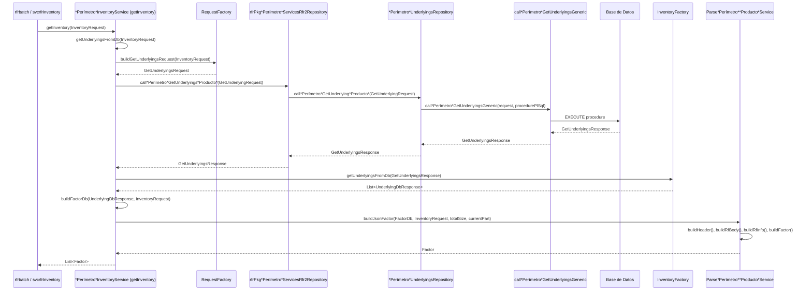

## rfrInventoryLib

**rfrInventoryLib** es una librería Java que abstrae la obtención de inventarios desde la base de datos, mapeando resultados a objetos de dominio (`Factor`). Se utiliza principalmente en dos proyectos:

- **rfrbatch**
- **svcrfrInventory**

Ambos proyectos invocan clases específicas de servicio que implementan el método `getInventory(...)`. Estas clases están ligadas a un perímetro y producto específico, por ejemplo:

- `IrCrvTaylorScmInventoryService`
- `FxSptImaCsmInventoryService`
- `ComVolFullRevalScmInventoryService`

---

### Flujo de procesamiento detallado



---

### 1. `getInventory(InventoryRequest)`

Recibe un objeto `InventoryRequest` (ejemplo de JSON a completar):

```json
{
  "type": "...",
  "inventoryCategory": "...",
  "organization": "...",
  "unit": "...",
  "dataDatePart": "..."
  // ... otros campos necesarios ...
}
```

Esta entrada determina qué implementación de servicio se utiliza y cómo se filtran los datos para la consulta.

### 2. Construcción del Request para BD

Se invoca a `RequestFactory.buildGetUnderlyingsRequest(...)` para transformar el `InventoryRequest` en un `GetUnderlyingsRequest`, el cual contiene la `unit`, `dataDatePart` y otras propiedades relevantes.

### 3. Llamada a la base de datos

Dependiendo del perímetro (Taylor, FullReval, etc.), se elige una clase como `frAPkgTaylorServicesRfr2Repository`, que tiene métodos específicos como `callTaylorGetUnderlyingsFxSpt(...)` o `callFullRevalGetReturnProxy_FxSpt(...)`, que a su vez invocan un repositorio subyacente (por ejemplo, `TaylorUnderlyingsRepository`) para ejecutar `callTaylorGetUnderlyingsGeneric(...)`.

Todos estos métodos reciben un `GetUnderlyingsRequest` y devuelven un `GetUnderlyingsResponse` con los resultados de la base de datos.

### 4. Conversión a `UnderlyingDbResponse`

Con el resultado (`GetUnderlyingsResponse`) se llama a `InventoryFactory.getUnderlyingsFromDb(...)`, que transforma este objeto en una lista de `UnderlyingDbResponse`.

### 5. Mapeo y construcción de `Factor`

Se construye un `FactorDb` a partir del `UnderlyingDbResponse` y el `InventoryRequest`, invocando métodos que generan listas internas como:

- `getSigomTemplatePoints(...)`
- `getSigomNativePoints(...)`
- `getSigomProxies(...)`
- `getSigomCrvPropertiesResponse(...)`
- `getExtraTenors(...)`

Luego se usa la clase `ParseTaylorIrCrvService` (o su variante por perímetro/producto) para construir el objeto final `Factor` mediante el método `buildJsonFactor(...)`, que invoca a:

- `buildHeader(...)`: genera `HeaderCtrl`
- `buildRfBody(...)`: genera `RfBody`
- `buildRfInfo(...)`: compone la sección de información financiera
- `buildFactor(...)`: ensambla todo en un `Factor`

Finalmente, se retorna `List<Factor>` al cliente.

---

### Estructura de `Factor`

```java
public class Factor {
    private String factorId;
    private BigDecimal value;
    private String unit;
    private LocalDate date;
    private HeaderCtrl header;
    private RfBody rfBody;
    private RfInfo rfInfo;
    private List<ProxyObject> proxies;
    // ... otros campos relevantes ...
}
```

### Puntos sugeridos para ampliar

1. **Validaciones y errores**: comportamiento ante respuestas vacías o errores de base de datos.
2. **Logging**: ¿se utiliza algún logger? ¿en qué niveles?
3. **Cache**: ¿existe caché de respuestas por `InventoryRequest`?
4. **Extensibilidad**: cómo añadir nuevos productos o perímetros sin duplicar código.
5. **Tests**: ejemplos de pruebas unitarias para `getInventory()` y de integración para `Parse*Service`.

---

> *Este README documenta el flujo interno y las responsabilidades técnicas de ****rfrInventoryLib****. Puedes expandir secciones específicas o vincular a documentación adicional según sea necesario.*

