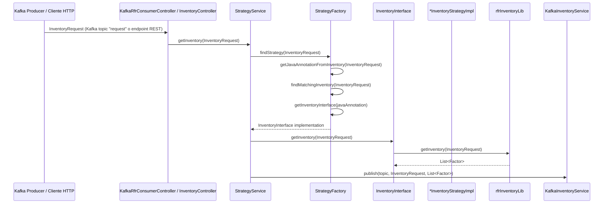

## svcrfrInventory

**svcrfrInventory** es un microservicio cuya principal responsabilidad es procesar solicitudes de inventario enviadas mediante Kafka o HTTP. A partir de un `InventoryRequest` recibido, construye y publica individualmente los factores (`Factor`) correspondientes al `idFuncionality` indicado.

Este servicio actúa como consumidor de mensajes y orquestador de la lógica para obtener y transformar los inventarios, utilizando la librería `rfrInventoryLib` para acceder a la base de datos.

---

### Flujo general (Kafka y REST)



---

### Componentes principales

#### 1. `KafkaRfrConsumerController`

Contiene un `@KafkaListener` llamado `serviceRequestConsumer` que escucha el topic `request`. Al recibir un mensaje:

- Deserializa el `InventoryRequest`
- Llama a `StrategyService.getInventory(...)`

#### 2. `InventoryController`

Expone el endpoint REST `/database/inventories/`, que permite procesar manualmente una solicitud de inventario desde HTTP. Útil para pruebas o llenado inicial.

#### 3. `StrategyService`

Contiene el método `getInventory(InventoryRequest)` que devuelve un `InventoryResponse`. Su flujo interno es:

- Llamar a `StrategyFactory.findStrategy(InventoryRequest)` para determinar la implementación.
- Obtener los `Factor` y realizar validaciones.
- Publicarlos a Kafka mediante `KafkaInventoryService`.

#### 4. `StrategyFactory`

Encargada de resolver dinámicamente la implementación (`InventoryInterface`) adecuada según los datos del `InventoryRequest`.

- Utiliza el método `getJavaAnnotationFromInventory(...)` para obtener el nombre del inventario asociado a la solicitud, utilizando la tabla `RFR.T_RF*_INVENTORIES`.
- Luego llama a `findMatchingInventory(...)` que retorna un `Optional<TrfrInventoriesDto>` si encuentra coincidencia.
- De ese DTO se extrae el `javaAnnotation` y se consulta el `StrategyNameEnum`, el cual está mapeado a su implementación correspondiente en un `HashMap<StrategyNameEnum, InventoryInterface>`.

> **Ejemplo de registro en la tabla **``:
>
> | JAVA\_ANNOTATION         | TYPE | FACTOR\_TYPE | ASSET\_CLASS | ORGANIZATION |
> | ------------------------ | ---- | ------------ | ------------ | ------------ |
> | TAYLOR\_IRCRV\_TEMPLATE  | IR   | CRV          | IR           | TAYLOR       |
> | FULLREVAL\_FXSPT\_NATIVE | FX   | SPT          | FX           | FULLREVAL    |

#### 5. `InventoryInterface`

Interface que tiene más de 50 implementaciones, una por combinación de Producto / Asset Class / Perímetro. Todas implementan el método `getInventory(InventoryRequest)`.

Cada implementación utiliza el correspondiente servicio de `rfrInventoryLib`, por ejemplo:

- `TaylorIrCrvCsmInventoryService`
- `FullRevalFxSptCsmInventoryService`

#### 6. `rfrInventoryLib`

Se encarga de consultar la base de datos y retornar los `Factor`.

#### 7. `KafkaInventoryService`

Recibe:

- Un `String topic`
- El `InventoryRequest`
- La `List<Factor>`

Convierte cada factor a JSON y lo publica en Kafka. El topic de salida suele ser `riskFactor` y se usa el `idFuncionality` como identificador de correlación.

---

### Estructura típica de `InventoryRequest`

```json
{
  "type": "FX",
  "inventoryCategory": "SPT",
  "organization": "TAYLOR",
  "unit": "USD",
  "dataDatePart": "2023-12-31",
  "idFuncionality": "abc-123-xyz"
  // otros campos relevantes
}
```

---

### Publicación a Kafka

- Cada `Factor` generado se convierte a JSON y se publica en el topic definido (e.g. `riskFactor`).
- Se utiliza el `idFuncionality` del request para correlacionar cada mensaje.

---

### Ejemplo de flujo

1. Se publica un `InventoryRequest` al topic Kafka `request`, o se envía vía endpoint HTTP.
2. El servicio invoca `StrategyService.getInventory(...)`.
3. Se determina la implementación correcta a través del `javaAnnotation` y el `StrategyNameEnum`.
4. Se obtienen los factores desde `rfrInventoryLib`.
5. Los factores se validan y se publican uno por uno a Kafka.

---

> *Este README documenta el comportamiento general y flujo técnico de ****svcrfrInventory****. Puedes complementarlo con detalles de configuración Kafka o definiciones de esquemas según sea necesario.*

